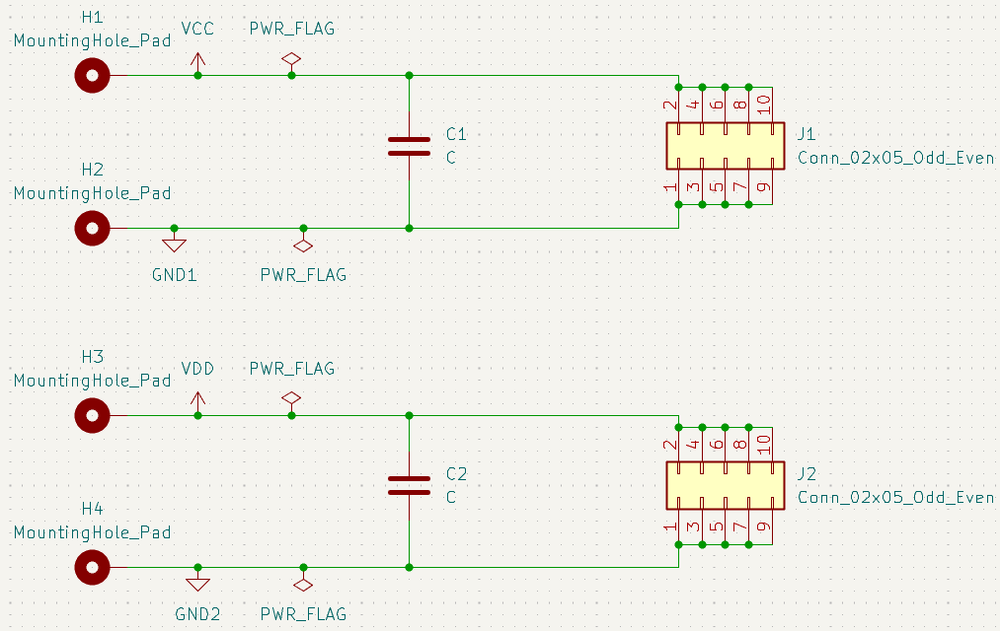

# ProtoboardSource-PCB
Repositorio del diseño de una PCB que permite conectar directamente cables con conector banana para alimentar una protoboard

Este repositorio y sus contenidos fueron diseñados por:

|        **Nombre**      | **Correo electrónico**|
|:---------------------------:|:---------------------:|
|   Rodrigo Madrigal Montes   |  rmadrigalmontes@gmail.com |

## Organización y contenido de los directorios 

Este repositorio contiene dos directorios principales, cuyos contenidos son:

- `kicad_project`: Contiene los archivos de diseño y configuarción del proyecto
    - `CargadorWalkieTalkie.kicad_pcb`
    - `CargadorWalkieTalkie.kicad_pro`
    - `CargadorWalkieTalkie.kicad_sch`

- `outputs`: Contiene todos los archivos de salida de *KiCad*

Si se desea utilizar este diseño y manufacturarlo por medio de un fabricante se debe comprimir los archivos incluidos en la carpeta `outputs` en un archivo `.zip` y este se puede cargar en la página del fabricante para ordenar la fabricación de la PCB. 

## Diseño del esquemático

El propósito del circuito es poder alimentar de forma segura y firme una *protoboard* o *breadboard* con cables banana provenientes de fuentes profesionales de laboratorio, para evitar conexiones flojas, peligrosas e ineficientes; como por ejemplo enrollar un cable alrededor del conector banana e introducirlo luego en la *protoboard*. 

Para solucionar este problema se propone el circuito representado en el siguiente esquemático:

|  |
|:--:|
| *Diseño del esquemático* |

Como se observa se cuenta con dos circuitos de alimentación idénticos por separado, uno para cada pista de alimentación de la protoboard. Además en cada circuito se encuentra un capacitor que tiene la función de filtrar ruido proveniente de la fuente que se esté utilizando. 

Otra observación importante es el hecho de que los conectores que entran en lo pines de la *protoboard* están conectados en paralelo, se tomó la decisión de usar cinco pares de pines entre el positivo y negativo de la fuente en lugar de un solo par de pines para dar mayor estabilidad al momento de conectarse en la *protoboard*. Pero si se desea usar menos pines al estar todos en paralelo no habría ningún problema si se decide hacerlo de esta manera. 

