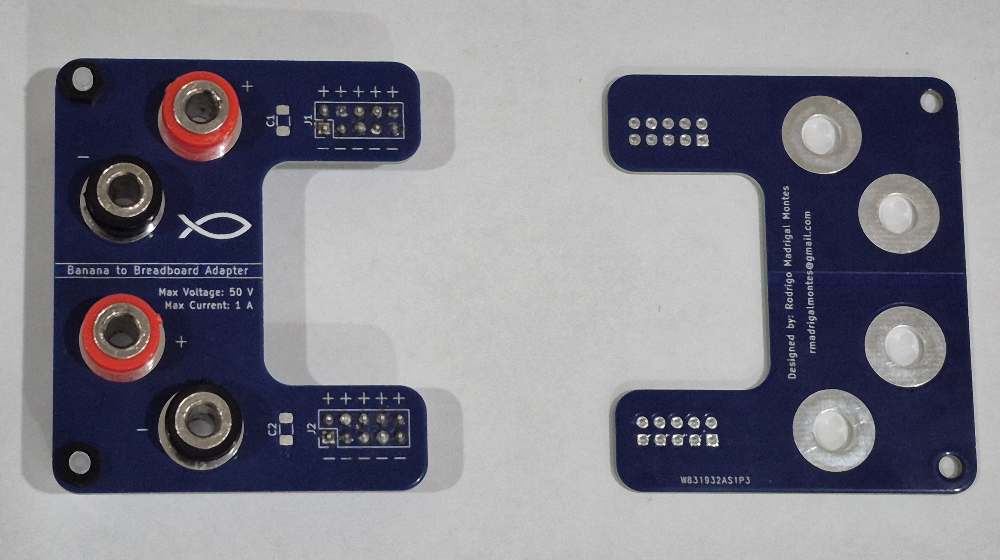
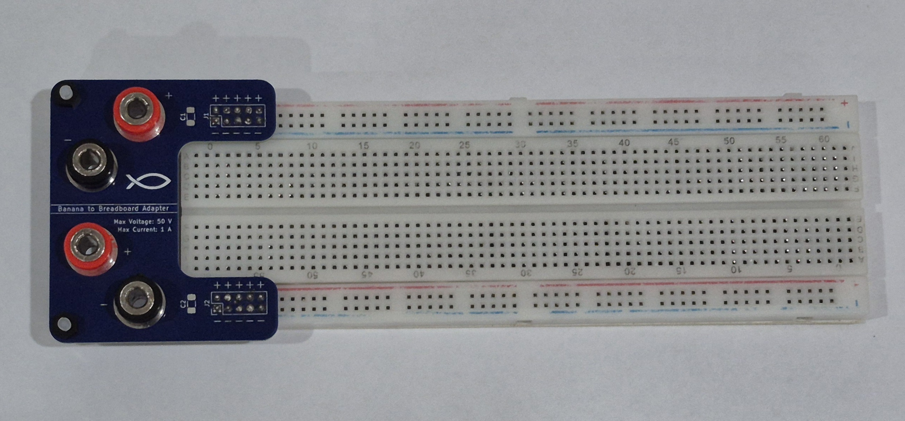
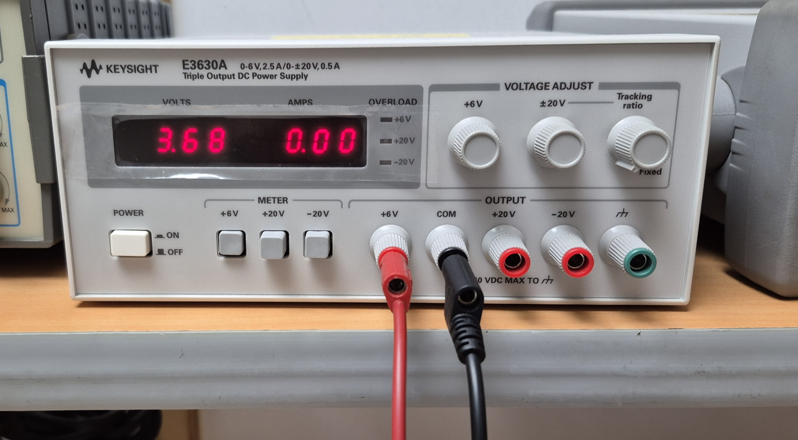
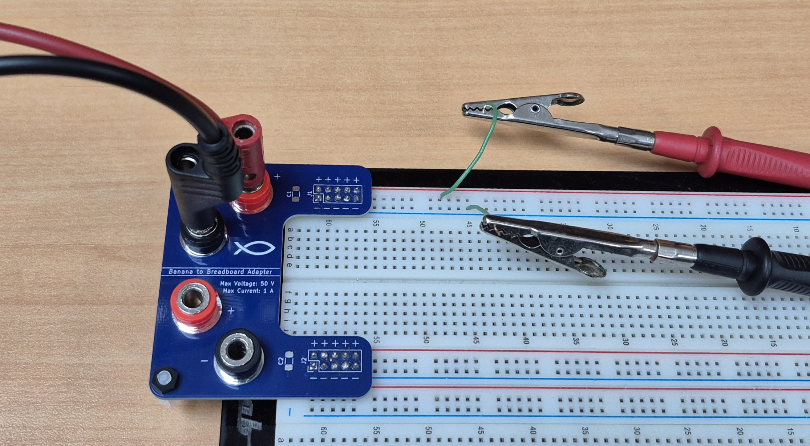
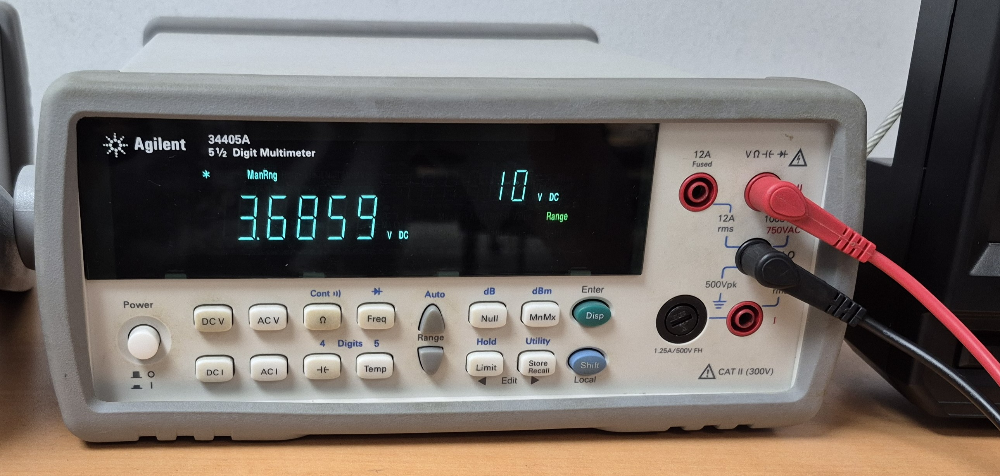
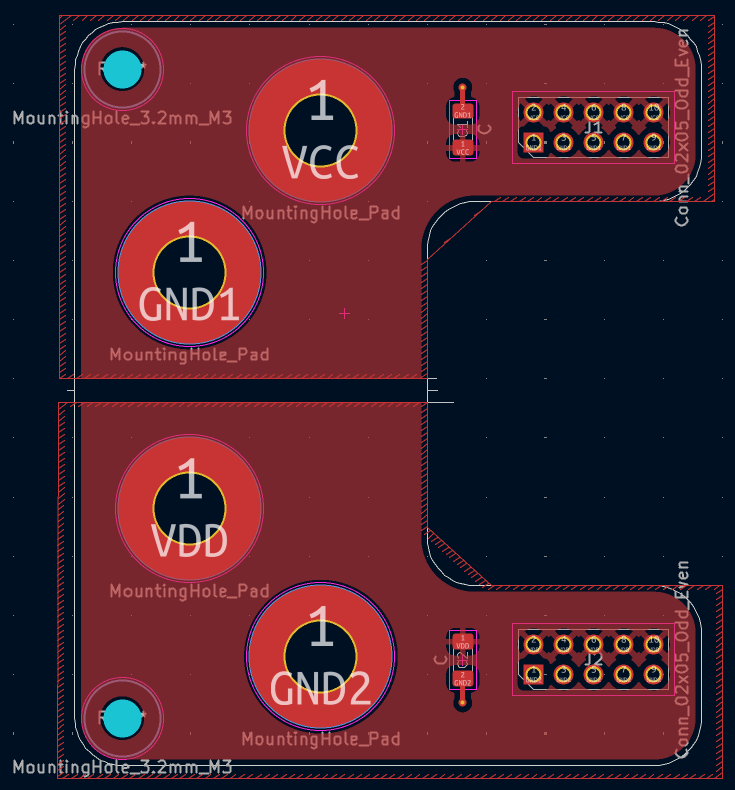
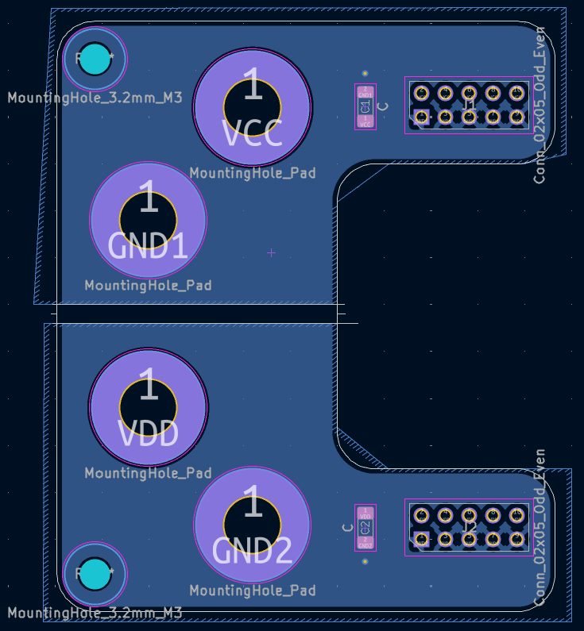
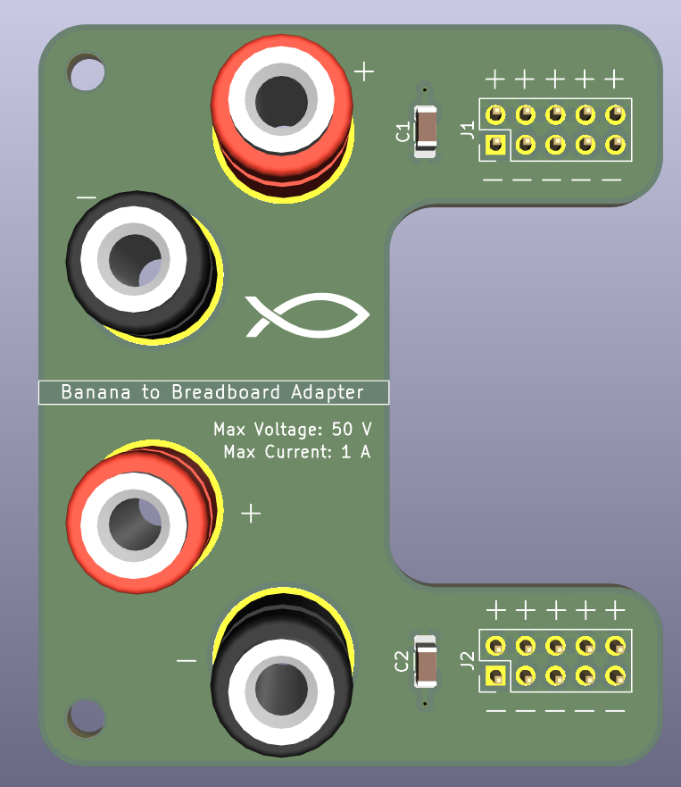
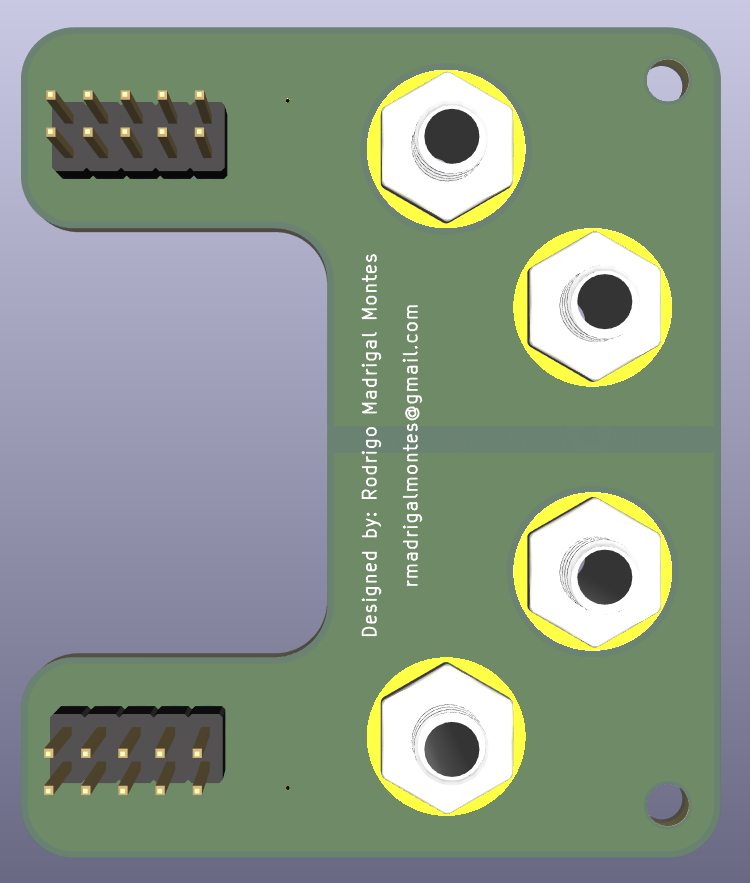

# ProtoboardSource-PCB
Repositorio del diseño de una PCB que permite conectar directamente cables con conector banana para alimentar una protoboard

Este repositorio y sus contenidos fueron diseñados por:

|        **Nombre**      | **Correo electrónico**|
|:---------------------------:|:---------------------:|
|   Rodrigo Madrigal Montes   |  rmadrigalmontes@gmail.com |

## Agradecimientos a PCBWay

Quiero expresar mi agradecimiento a **PCBWay** por su colaboración y apoyo en la fabricación de esta PCB. La calidad de las placas recibidas, tanto en precisión de fabricación como en acabados, encajaron perfectamente con las dimensiones y especificaciones con las que las diseñé. Esto siempre es vital y más aún en una PCB de este tipo que debe encajar en una *Protoboard* con dimensiones muy específicas. 

### PCB ensamblada

Una vez recibidas las placas de **PCBWay**, se procedió con el ensamblaje manual de todos los componentes. A continuación se muestran imágenes del resultado final:

|  |
|:--:|
| *PCB ensamblada - no montada en la Protoboard* |

|  |
|:--:|
| *PCB ensamblada - montada en la Protoboard* |

### Demostración de funcionamiento

A continuación, se presentan imágenes mostrando la PCB montada en una *Protoboard* y conectada a una fuente de tensión de laboratorio, y midiendo la tensión que suministra con un multímetro:

|  |
|:--:|
| *Fuente de laboratorio ajustada en 3.68 V* |

|  |
|:--:|
| *PCB conectada a la fuente y montada en la Protoboard* |

|  |
|:--:|
| *Medida de tensión suministrada a la Protoboard* |

Gracias a su servicio confiable y de altísima calidad, logré ensamblar y probar con éxito esta PCB, cumpliendo el objetivo del diseño. Recomiendo sus servicios para estudiantes, profesionales y cualquier persona interesada en manufacturar PCBs de alta calidad. Más información en [pcbway.com](https://www.pcbway.com).

## Organización y contenido de los directorios 

Este repositorio contiene dos directorios principales, cuyos contenidos son:

- `kicad_project`: Contiene los archivos de diseño y configuarción del proyecto
    - `CargadorWalkieTalkie.kicad_pcb`
    - `CargadorWalkieTalkie.kicad_pro`
    - `CargadorWalkieTalkie.kicad_sch`

- `outputs`: Contiene todos los archivos de salida de *KiCad*

Si se desea utilizar este diseño y manufacturarlo por medio de un fabricante se debe comprimir los archivos incluidos en la carpeta `outputs` en un archivo `.zip` y este se puede cargar en la página del fabricante para ordenar la fabricación de la PCB. 

## Diseño del esquemático

El propósito del circuito es poder alimentar de forma segura y firme una *protoboard* o *breadboard* con cables banana provenientes de fuentes profesionales de laboratorio, para evitar conexiones flojas, peligrosas e ineficientes; como por ejemplo enrollar un cable alrededor del conector banana e introducirlo luego en la *protoboard*. 

Para solucionar este problema se propone el circuito representado en el siguiente esquemático:

|  |
|:--:|
| *Diseño del esquemático* |

Como se observa se cuenta con dos circuitos de alimentación idénticos por separado, uno para cada pista de alimentación de la protoboard. Además en cada circuito se encuentra un capacitor que tiene la función de filtrar ruido proveniente de la fuente de alimentación que se esté utilizando. 

Otra observación importante es el hecho de que los conectores que entran en lo pines de la *protoboard* están conectados en paralelo, se tomó la decisión de usar cinco pares de pines entre el positivo y negativo de la fuente en lugar de un solo par de pines para dar mayor estabilidad al momento de conectarse en la *protoboard*. Pero si se desea usar menos pines al estar todos en paralelo no habría ningún problema si se decide hacerlo de esta manera. 

## Lista de componentes

A continuación se incluye una lista con los componentes utilizados en el diseño, con el mismo número que se les asignó en el diseño final de PCB:

|   Componente   |   Valor / Modelo    |    Descripción    |
|:--------------:|:-------------------:|:-----------------:|
| C1 / C2   |   10 µF a 50 V           |   Capacitor cerámico SMD 1206    |
| Pines para conectar a la Protoboard    |     Pin Headers de 2.54mm de separación y 11.5mm de longitud   |   Pin Headers     |
|Conectores Banana para alimentación    |     Conector Banana Hembra para chasis           |   Conector Banana Hembra     |
| Postes de nylon    |     Postes y tuercas de nylon M3           |   Postes y tuercas de nylon     |

## Diseño de la PCB

Una vez definido el circuito final, se diseñó la PCB en *KiCad* con una arquitectura de **dos capas**:

- **F.Cu**: Plano de alimentación (VCC y VDD)
- **B.Cu**: Plano de tierra (GND1 y GND2)

### Capas de la PCB

|  |
|:-----------------------------:|
|    *Capa superior (F.Cu)*     |

|  |
|:-----------------------------:|
|    *Capa inferior (B.Cu)*     |

> [!NOTE]
> Se observa como los planos de alimentación positiva (VCC, VDD) y alimentación negativa (GND1, GND2) están separados por un espaciado físico en la parte central de la PCB para evitar cualquier tipo de interferencia o fuga de corriente entre ambos rieles de alimentación al conectarlo en la *Protoboard*.

Además, se agregaron zonas de serigrafía, agujeros de montaje, así como textos identificativos y un logotipo en el *silkscreen*, además del nombre del proyecto y los datos del autor. Finalmente se muestran resultados de la vista 3D de la PCB en KiCad. 

|  |
|:--:|
| *Vista 3D Frontal de la PCB en KiCad* |

|  |
|:--:|
| *Vista 3D Trasera de la PCB en KiCad* |

